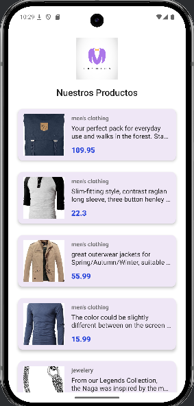

Claro, aquí tienes el texto del README adaptado para describir únicamente la pantalla que se muestra en la imagen.

App de Catálogo de Productos 🛍️
Este es un proyecto de Android sencillo, desarrollado en Java con Android Studio, que muestra un catálogo de productos consumiendo datos de una API pública.

## Descripción
La aplicación consiste en una única pantalla que muestra una lista de productos obtenidos directamente desde la Fake Store API. Cada elemento de la lista presenta la imagen, categoría, una breve descripción y el precio del producto, todo en una interfaz clara y directa.

## Características
Visualización de productos: Muestra los artículos en una lista vertical (ListView) con un diseño moderno de tarjetas.

Consumo de API: Obtiene y muestra datos en tiempo real desde un servicio RESTful (GET).

Interfaz Limpia: Carga de imágenes desde una URL para cada producto, integrándolas en la vista de tarjeta.

